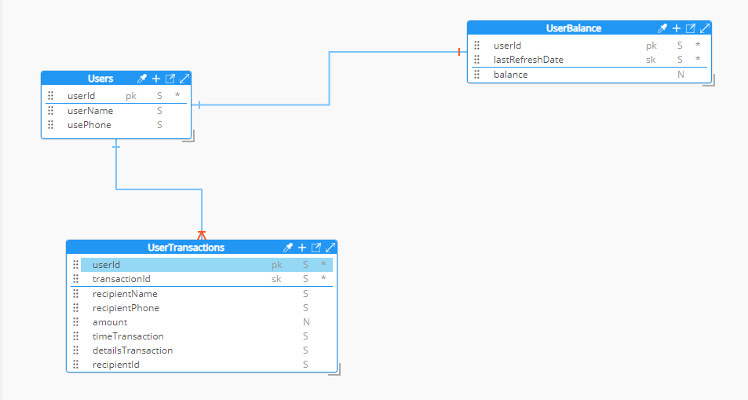

<h1 align="center" style="color: blue;">Wink</h1>

<h2>Repositorio de la Aplicación Wink UI</h2>

Repositorio para el desarrollo de la aplicación Wink UI.

  <h3>Objetivo</h3>
  
Desarrollar una aplicación móvil en React Native que simula el envío de dinero por SINPE Móvil y muestra un historial de estos envíos.

  <h3>Requerimientos</h3>
  <h4>1. Pantalla Inicial</h4>
  <ul>
      <li>Al ingresar a la aplicación, se debe mostrar:
          <ul>
              <li>El balance actual del usuario</li>
              <li>Los movimientos de dinero realizados por el usuario</li>
              <li>Un botón para realizar un envío SINPE Móvil (sin transacciones de dinero reales)</li>
          </ul>
      </li>
  </ul>
  <h4>2. Balance</h4>
  
El balance está almacenado en la base de datos y se obtiene cada vez que el usuario entra a la aplicación o realiza la acción de "pullto refresh".

  <h4>3. Movimientos</h4>
  
Mostrar una lista de todos los movimientos realizados por el usuario, ordenados por fecha (del más reciente al más antiguo). Cadamovimiento debe incluir:

  <ul>
      <li>Nombre del contacto</li>
      <li>Monto</li>
      <li>Fecha</li>
      <li>Hora</li>
  </ul>
  <h4>4. Detalles de Movimientos</h4>
  
Al seleccionar un movimiento, se deben mostrar sus detalles:

  <ul>
      <li>Nombre del contacto</li>
      <li>Número de teléfono del destinatario</li>
      <li>Monto</li>
      <li>Fecha y hora del movimiento</li>
  </ul>
  <h4>5. Botón de Envío</h4>
  
Al hacer tap en este botón, se inicia el siguiente flujo:

  <ol>
      <li>Se muestra una pantalla con la lista de contactos del dispositivo, permitiendo al usuario seleccionar uno.</li>
      <li>Luego de seleccionar un contacto, se muestra otra pantalla solicitando el monto a transferir, una descripción y un botón de"Aceptar".</li>
      <li>Al aceptar:
          <ul>
              <li>Se reduce el balance del usuario según el monto del envío.</li>
              <li>Se genera un nuevo movimiento.</li>
              <li>La aplicación navega de regreso a la pantalla principal, donde se muestra la lista de movimientos actualizada con el nuevoenvío.</li>
          </ul>
      </li>
  </ol>
  <h4>6. Animación de Carga</h4>
  
Mostrar una animación de carga cuando la aplicación esté esperando datos.

  <h4>7. Carga Diferida (Lazy Loading)</h4>
  
Los movimientos se cargan de 10 en 10. Al llegar al último movimiento cargado, se obtienen y muestran otros 10, y así sucesivamentehasta que no queden más movimientos por cargar.

  <h3>Requerimientos Técnicos</h3>
  <ul>
      <li>Crear repositorios separados en GitHub para la aplicación móvil y el backend:
          <ul>
              <li><strong>Aplicación Móvil</strong>: Desarrollada en React Native con TypeScript y Expo.</li>
              <li><strong>Backend</strong>: Desarrollado en Node.js, accesible mediante una o más funciones Lambda en AWS.</li>
          </ul>
      </li>
      <li><strong>Almacenamiento de Datos</strong>: Se puede utilizar cualquier motor de base de datos, recomendando DynamoDB de AWS porsimplicidad.</li>
  </ul>
  <h3>Diseño de la Aplicación</h3>
  
El diseño de la aplicación se encuentra aquí: <a href="https://www.figma.com/file/E2FpYVGGakgu0qyBDdWA8A/Wink---Prueba-t%C3%A9cnicanode-id=0%3A1">Diseño en Figma</a>

  <h3>Estandares</h3>
  <ul>
      <li><strong>Lenguaje para Programar</strong>: Inglés</li>
      <li><strong>Variables</strong>: <code>camelCase</code>
          <pre><code>const varExample = ""</code></pre>
      </li>
      <li><strong>Constantes</strong>: <code>UPPERCASE_SNAKE_CASE</code>
          <pre><code>const CONSTANTE_EJEMPLO = ""</code></pre>
      </li>
      <li><strong>Funciones</strong>: <code>camelCase</code>
          <pre><code>function funcionEj() {}</code></pre>
      </li>
      <li><strong>Componentes</strong>: <code>PascalCase</code>
          <pre><code>function FuncionEj() {}</code></pre>
      </li>
  </ul>
  <h3>Estructura de Carpetas</h3>
  <!-- Aquí puedes agregar la estructura de carpetas si la tienes definida -->
  <h3>Estructura de Base de Datos</h3>
  <h4>Diagrama</h4>
  

      
  

  <h3>Patrones de Acceso</h3>
  <ul>
      <li><strong>Users</strong>
          <ul>
              <li>Get User Info (Read)</li>
              <li>Get balance User Info (Read)</li>
              <li>Update balance User Info (Write)</li>
          </ul>
      </li>
      <li><strong>UserTransaction</strong>
          <ul>
              <li>Get Transaction History (Read)</li>
              <li>Create New Transaction (Write)</li>
          </ul>
      </li>
  </ul>
  <h3>Diseño de Primary Key</h3>
<table>
  <thead>
    <tr>
      <th>Tabla</th>
      <th>Partition Key</th>
      <th>Sort Key</th>
      <th>Descripción</th>
    </tr>
  </thead>
  <tbody>
    <tr>
      <td>Users</td>
      <td>userId</td>
      <td>-</td>
      <td>Identifica de manera única a cada usuario en el sistema.</td>
    </tr>
    <tr>
      <td>UserBalance</td>
      <td>userId</td>
      <td>lastRefreshDate</td>
      <td>Identifica de manera única cada registro de balance por usuario, permitiendo almacenar un historial y actualizar el balance.</td>
    </tr>
    <tr>
      <td>UserTransactions</td>
      <td>userId</td>
      <td>transactionId</td>
      <td>Identifica de manera única cada transacción de un usuario, permite ordenar las transacciones.</td>
    </tr>
  </tbody>
</table>